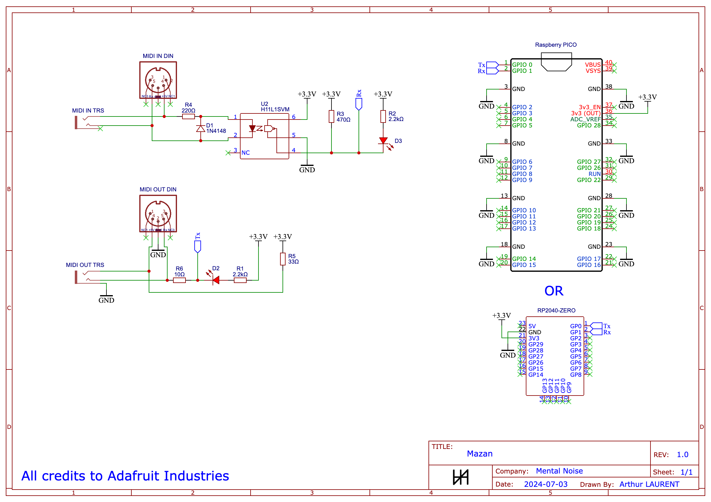

# Mazan

Mazan is a simple Rapsberry pico based MIDI-USB Interface.

Without any surprise, it does 2 things:
- it receives MIDI commands from a MIDI device and send them to your computer via USB
- it receives MIDI commands from your computer via USB and send them to a MIDI device

## Hardware

This project is based on the [Adafruit MIDI featherwing](https://learn.adafruit.com/adafruit-midi-featherwing/overview), you can either use that module or build it yourself following this guide.

### BOM

To do it yourself, you'll need:
- 1x Raspberry pico (or RP2040-zero for smaller factor)
- 1x H11L1 optocoupler
- 2x MIDI DIN 5 pins connector (or stereo/TRS jack or both depending on your preferences)
- 2x 2.2kΩ resistor
- 1x 470Ω resistor
- 1x 220Ω resistor
- 1x 33Ω resistor
- 1x 10Ω resistor
- 2x LED
- 1x 1N4148 diode

### Schematics

## Software

### Cleanup your raspberry pico

Download [FlashNuke](https://github.com/dwelch67/raspberrypi-pico/blob/main/flash_nuke.uf2).  
Connect your raspberry pico to your computer while holding the `boot` button pressed.  
Copy/paste the file named `flash_nuke.uf2` on the raspberry pico drive, it will completely erase what's on your raspberry pico and automatically eject and re-mount it.

### Install CircuitPython

Download the latest version of [CircuitPython](https://circuitpython.org/board/raspberry_pi_pico/) (v9.0.5 at time of writing) and extract the zip content.  
Connect your raspberry pico to your computer while holding the `boot` button pressed.  
Copy/paste the CircuitPython firmware (file named `adafruit-circuitpython-raspberry_pi_pico-en_US-9.0.5.uf2` in my case) on the raspberry pico drive, it will automatically eject and re-mount.

### Add the software

Copy the code from [code.py](./code.py) in this repository.  
Open the file named `code.py` on your raspberry pico and replace its content with the code you just copied.  
Reset the raspberry pico.  
You're done.

## Debugging / Troubleshooting

You can use tools like [MIDIView](https://hautetechnique.com/midi/midiview/) to check the messages coming from any USB MIDI interface, it helps to see if the MIDI IN part is working.

You can use tools like [VMPK](https://vmpk.sourceforge.io/), a virtual MIDI piano keyboard to send commands from your computer to a MIDI device connected to any USB MIDI interface.

If either of the MIDI connections is not working, try switching the connector cables, sometimes it really is that easy.
